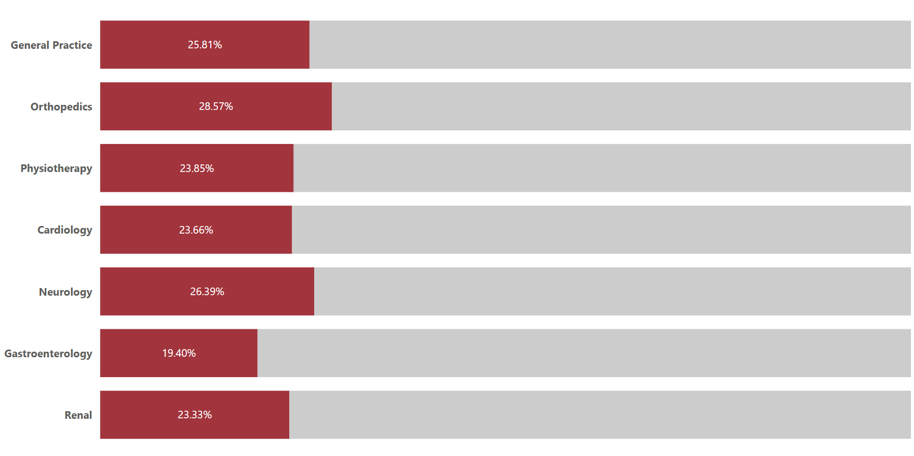
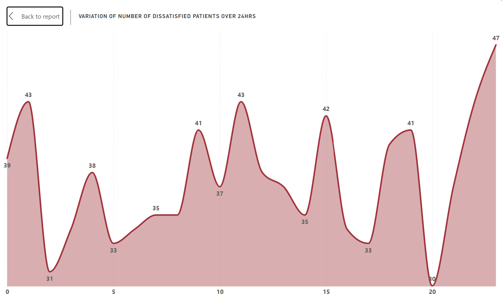
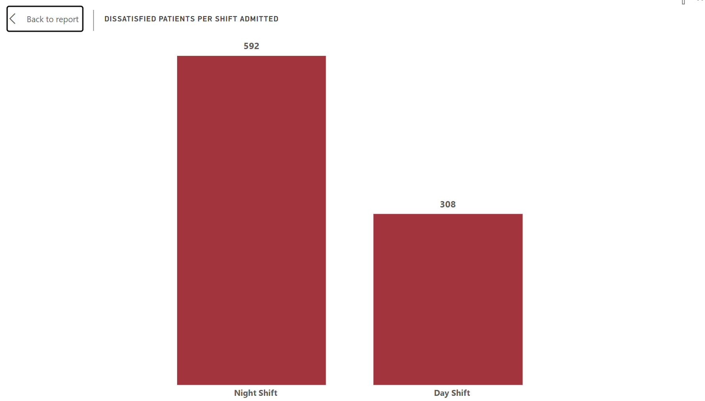
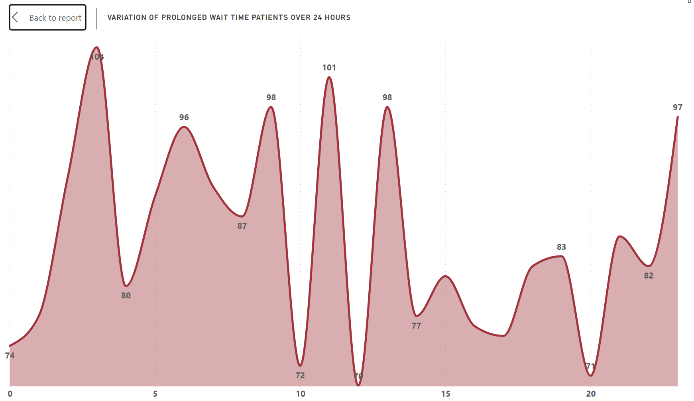
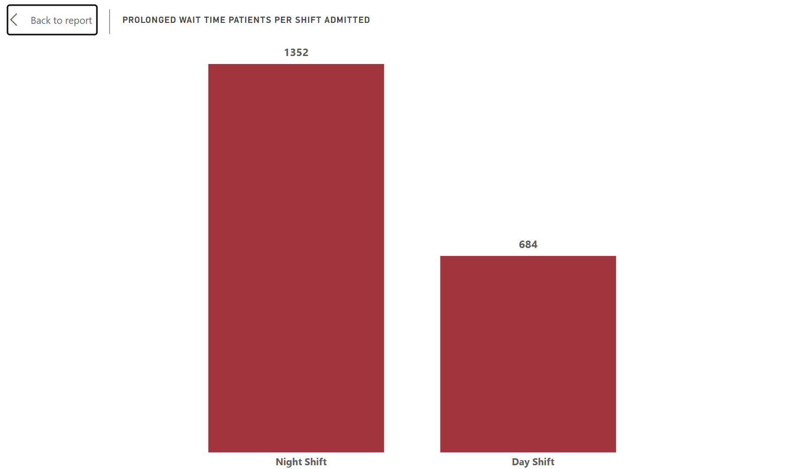
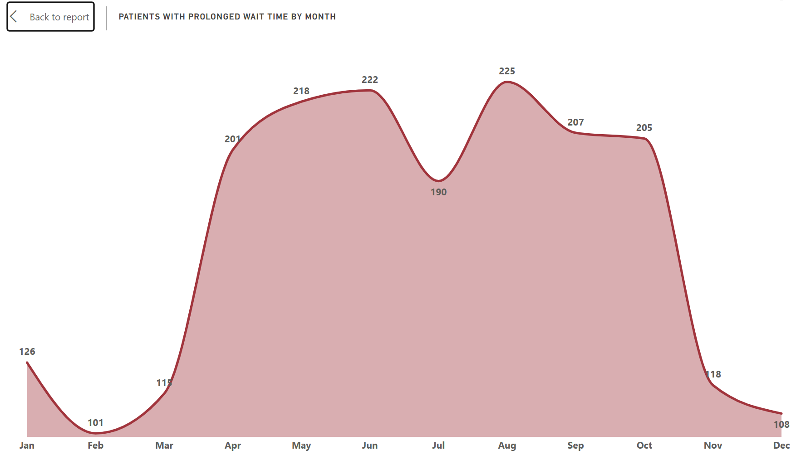
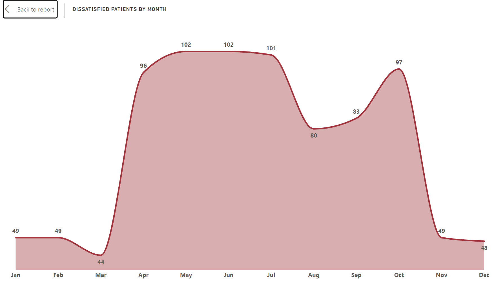
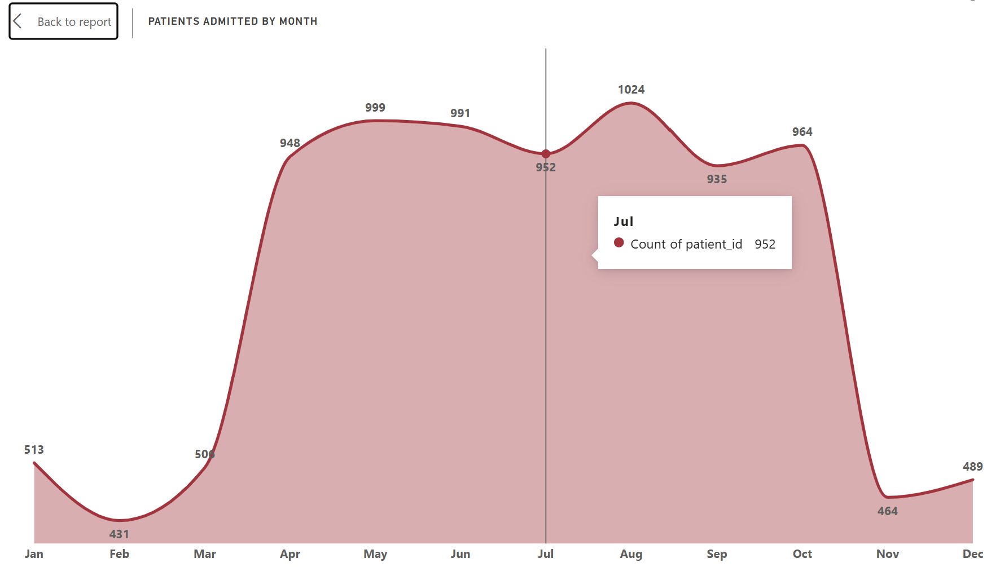
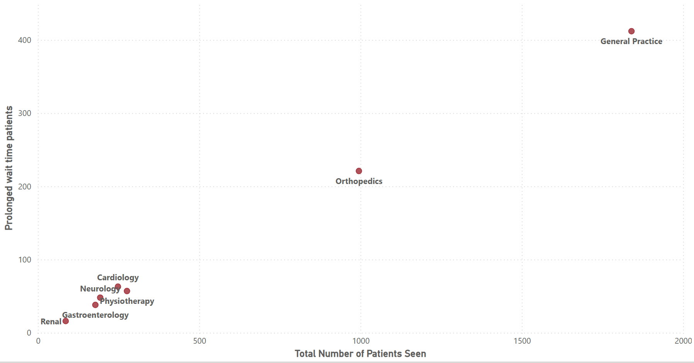
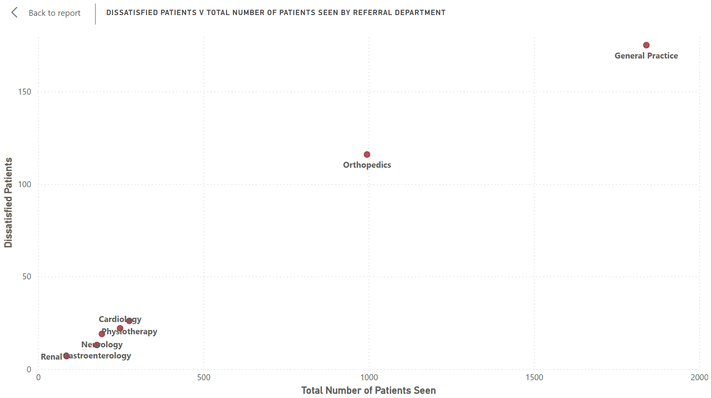

# Understanding Trends and Factors Associated with Poor Patient Satisfaction

## Introduction/Project Overview
Everyday, patients stroll through hospital doors in desperate need for care. While most would argue that the most important metric to be considered in the assment of the effectiveness of the care rendered to patients is the ability to offer the right treatment that relieves them of their suffering, however overtime more factors have become increasingly important in defining proper and effective healthcare. 

While these factors may not be directly related with the ongoing pathology in these patients, especially from the perspective of the Doctor, however, they are considered very important by the patients. Hence our focus must shift from ourselves to our patients, understanding their needs beyond the disease that ails them. **After all, who gets to define satisfactory healthcare? Is it the administrator or the recipient?**

Hence this project attempts to understand the factors responsible for unsatisfactory healthcare as well as seasonal trends which would form the basis of actionable recommendations for current and future improvement of patient satisfaction. 
## Objectives
As stated above, this project aims to criticaly analyze unsatisfactory healthcare by answering the following questions:
1. Average wait time per referral department/Number of patients with prolonged wait time per department?
2. Average satisfaction score per referral department/Number of dissatisfied patients per department?
3. Is there a relationship between wait time and satisfaction score?
4. What time of the day is associated with longer wait time and poorer satisfaction scores?
5. What months of the year are associated with longer wait time and poorer satisfaction scores?
6. Can unsatisfactory healthcare be attributed to increased patient volume?
## Data Source 
This dataset is a synthetic data sourced from [healthcare_analytics_patientflow_data](https://www.kaggle.com/datasets/hassanjameelahmed/healthcare-analytics-patient-flow-data).
It contains 9,216+ patient encounter records from a medium-sized hospital facility spanning September 2023 to December 2024.
## Tools Used
* Postgres
* VScode
* PowerBI(DAX inclusive)
* Spreadsheet(WPS Office)
## Analysis
### 1. Average wait time per referral department/Number of patients with prolonged wait time per department?
To understand the average wait time per department, I employed the following sql code:
```SQL
SELECT
    Referral_department,
    ROUND(AVG(Patient_wait_time), 2) AS avg_wait_time
FROM
    patient_time_fact
WHERE
    Referral_department <> 'None'
GROUP BY
    Referral_department
ORDER BY avg_wait_time DESC;


-- 1b Number of patients with wait time >= 50 by departmet
SELECT
    COUNT(patient_id) AS number_of_patients,
    Referral_department
FROM
    patient_time_fact
WHERE
    patient_wait_time >= 50
AND
    referral_department <> 'None'
GROUP BY referral_department
ORDER BY number_of_patients DESC;
```
I also avoided including patients with no recorded  referral departments. 
I also used a benchmark wait time of 50 minutes in assessing departments associated with prolonged wait times. Thus for the purpose of this analysis, prolonged wait time is defined as wait time greater than or equal to 50 minutes.

#### Key Insights
There was no sigificant difference between the average wait time associated with each department. However on closer inspection, I discovered that the Departments of Genaral Practice and Orthopedics had the highest number of patients with prolonged wait time, 412 and  221 respectively.

I then proceeded to probe further and discovered that these departments had the most number of patients. 
I also analyzed the percentages of patients seen per referral department who experienced prolonged wait times. What I found was that although the numbers were highest for General Practice and Orthopedics departments, the relative proportions compared to the number of patients seen by each department was more or less the same.


**%Prolonged wait time patients by department**

### 2. Average satisfaction score per referral department/Number of dissatisfied patients per department?
To understand the average wait time per department, I employed the following sql code:
```SQL
SELECT
    Referral_department,
    ROUND(AVG(Patient_satisfaction_score), 2) AS avg_satisfaction_score
FROM
    patient_time_fact
WHERE 
    patient_satisfaction_score IS NOT NULL
AND
    referral_department <> 'None'
GROUP BY referral_department
ORDER BY avg_satisfaction_score ASC;


-- 2b Number of patients with satisfaction score <= 3 per department

SELECT
    COUNT(Patient_ID) AS patient_number,
    Referral_department
FROM
    patient_time_fact
WHERE 
    patient_satisfaction_score IS NOT NULL
AND
patient_satisfaction_score <= 3
AND
    referral_department <> 'None'
GROUP BY referral_department
ORDER BY patient_number DESC;
```
I also used a benchmark satisfaction score of less than or equal to 3 as a poor satisfaction score or to refer to dissatisfied patients. This is reasonable considering the fact that the maximum satisfaction score attainable is 10. This dataset included blank figures for Satisfaction scores. 
I avoided erroneously including these patients in the number of dissatisfied patients by excluding null values from my sql code. I also excluded patients with no documented departments.

#### Key Insights

There was no significant difference in the average satisfaction score recorded by departments. However, when I probed further to find out the number of dissatisfied patients per department, I discovered that General Practice and Orthopedics Departments recorded the most numbers of patients with satisfaction scores below or equal to 3. 
However the proportion of patients with poor satisfaction scores per each department was pretty much similar. 
This I supposed was also due to the number of patients referred to both departments which exceeded that for other departments. 

Hence, based on this anaysis and the preceding one, we can draw the conclusion that large patient volumes are related to dissatisfactory care. 
### 3. Is there a relationship between wait time and satisfaction score?
To analyze this, I firstly looked for a direct relationship between wait time and satisfaction score
```SQL
SELECT
    Referral_department,
    ROUND(AVG(Patient_wait_time), 2) AS avg_wait_time,
    ROUND(AVG(Patient_satisfaction_score), 2) AS avg_patient_satisfaction_score
FROM
    patient_time_fact
WHERE
    referral_department <> 'None'
GROUP BY referral_department;
```

On a general note, I couldn't find a perfect direct relationship between average wait time and average satisfaction score, however from the first two analyses done we can see that the departments with the highest number of patients with prolonged wait time also had the highest number of dissatisfied patients(General Practice and Orthopedics). We also see that these departments also had the highest amount of patient volume.
### 4. What time of the day is associated with longer wait time and poorer satisfaction scores?
In performing this analysis, I analyzed first according to the hour of the day. 
I then also separated the entire 24hrs into 2 separate shifts(Day & Night) and then performed my analyses accordingly.
* Day Shift: 08:00 to 15:59
* Night Shift: 16:00 to 07:59
 I employed the following code:
```SQL
ALTER TABLE patient_time_fact
ADD COLUMN patient_admission_hour INT;

UPDATE patient_time_fact
SET patient_admission_hour =
    EXTRACT(
        HOUR FROM patient_admission_time
    );

-- 4a. Using Night and Day shift flags

SELECT
    CASE
        WHEN patient_admission_time >= '08:00:00'
         AND patient_admission_time < '16:00:00'
        THEN 'Day shift'
        ELSE 'Night shift'
    END AS shift_time,
    COUNT(patient_id) AS patient_number
FROM patient_time_fact
WHERE patient_wait_time >= 50
GROUP BY
    CASE
        WHEN patient_admission_time >= '08:00:00'
         AND patient_admission_time < '16:00:00'
        THEN 'Day shift'
        ELSE 'Night shift'
    END;


SELECT
    CASE
        WHEN patient_admission_time >= '08:00:00'
         AND patient_admission_time < '16:00:00'
        THEN 'Day shift'
        ELSE 'Night shift'
    END AS shift_time,
    COUNT(patient_id) AS patient_number
FROM patient_time_fact
WHERE patient_satisfaction_score <= 3
GROUP BY
    CASE
        WHEN patient_admission_time >= '08:00:00'
         AND patient_admission_time < '16:00:00'
        THEN 'Day shift'
        ELSE 'Night shift'
    END;

-- 4b. Using hour of the day.

SELECT
    COUNT(Patient_ID) AS patient_number,
    patient_admission_hour
FROM
    patient_time_fact
WHERE
    patient_wait_time >= 50
GROUP BY patient_admission_hour
ORDER BY patient_number DESC;


SELECT
    COUNT(Patient_ID) AS patient_number,
    patient_admission_hour
FROM
    patient_time_fact
GROUP BY patient_admission_hour
ORDER BY patient_number DESC;
```
The division into shifts is particularly well suited to this analyses because this is what is obtainable in healthcare settings. 

#### Key Insights
What I found was that night shifts had the most number of dissatisfied patients as well as patients with prolonged wait time. 
A premature assumption would have been to attribute this difference to a difference in the quality of services provided across shifts, however, I disvcovered that there was also a proportionate difference in the number of patients admitted across both shifts over the period under study with the night shifts being linked with more admissions. 

**Trend of number of dissatisfied patients over 24hours.**


**Number of dissatisfied patients by shift admitted.**


**Trend of number of Prolonged wait time patients over 24hours.**


**Number of Prolonged wait time patients by shift admitted.**
### 5. What months of the year are associated with longer wait time and poorer satisfaction scores?

```SQL
ALTER TABLE patient_time_fact
ADD COLUMN patient_admission_month INT;

UPDATE patient_time_fact
SET patient_admission_month =
    EXTRACT(
        MONTH FROM TO_DATE(patient_admission_date, 'DD/MM/YYYY')
    );

ALTER TABLE patient_time_fact
ADD COLUMN patient_admission_year INT;

UPDATE patient_time_fact
SET patient_admission_year =
    EXTRACT(
        YEAR FROM TO_DATE(patient_admission_date, 'DD/MM/YYYY')
    );

-- 6a Relate to longer wait time

SELECT
    COUNT(Patient_ID) AS patient_number,
    Patient_admission_month
FROM
    patient_time_fact
WHERE
    patient_wait_time >= 50
GROUP BY
    Patient_admission_month
ORDER BY patient_number DESC;


--6b Relate to patient satisfaction score

SELECT
    COUNT(Patient_ID) AS patient_number,
    Patient_admission_month
FROM
    patient_time_fact
WHERE
    patient_satisfaction_score <= 3
GROUP BY
    Patient_admission_month
ORDER BY patient_number DESC;


SELECT
    COUNT(Patient_ID)
FROM
    patient_time_fact
WHERE
    patient_satisfaction_score IS NULL
GROUP BY
    Referral_department;
```

#### Key Insights 

**Trend of Number of patients with prolonged wait time over months** 


**Trend of Number of Dissatisfied patients over months** 


**Trend of total volume of patients over months**

What I discovered from this analyses was that the earlier months for the year, January to February were associated with the lowest number of Dissatisfied patients as well as patients with prolonged wait time. These numbers steadily increased over the next two months before maintaining a plateau for about 6 months and finally declining after, with November and December seeing a reduction in the number of Dissatisfied and Prolonged wait time patients.

This pattern was also seen with the trend of total patients seen over the months. Thus, strengthening my proposition that unsatisfactory care and prolonged wait time is largely linked to patient volume as there are no enough staff to cope with the increased patient load over these months.

This relationship between patient volume and unsatisfactory care/prolonged wait time is also seen in the daily trends discusssed earlier. 

### 6. Can unsatisfactory healthcare be attributed to increased patient volume?

**Relationship between number of prolonged wait time patients and total number of patients seen per department.**


**Relationship between number of Dissatisfied patients and total number of patients seen per department.**

The above scatter plots reveal a clear direct relationship between total patients seen and the number of dissatisfied and prolonged wait time patients associated with each department over the duration under review. This also corresponds with key findings in previous analyses. 

## Recommendations
### 1. Implement Demand-Based Staffing
This is one of the most important recommendations from the analysis. The hospital should consider adopting a demand-based staffing strategy to accommodate the observed variations in patient volume throughout the year.
Patient volumes appear to be higher between April and October, suggesting that additional staffing capacity may be required during these months. During periods of lower patient volume, staffing levels could potentially be adjusted to more closely reflect demand, subject to operational requirements.
Staffing adjustments should not be limited to doctors. Nurses, administrative personnel, and other relevant healthcare staff should also be considered based on the specific demands associated with increased patient volume.
Staff allocation should also take into account department-level variations in patient volume. General Practice and Orthopedics, which experience relatively high patient volumes in the analysis, should be assessed to determine whether their existing staffing levels are adequate to meet demand.
### 2. Investigate Additional Factors Associated with Patient Dissatisfaction
The analysis indicates an association between prolonged waiting times and lower patient satisfaction. However, waiting time may not be the only factor contributing to poor patient experiences.
Other factors, such as healthcare-worker communication, staff attitude, perceived quality of care, communication of delays, and the condition of hospital facilities, may also influence patient satisfaction.
The hospital should therefore consider collecting additional patient-feedback data through post-visit or post-discharge questionnaires, structured interviews, or other patient-feedback mechanisms. This would allow the hospital to identify additional factors associated with dissatisfaction that were not captured in the current dataset.
### 3. Optimize Night-Shift Staffing
The analysis identified higher levels of patient dissatisfaction during night shifts, alongside differences in patient volume between shifts.
This finding suggests that the hospital should assess whether current night-shift staffing levels are appropriately aligned with patient demand. Where a mismatch between staffing capacity and patient volume is identified, the hospital could consider increasing the number of doctors, nurses, and support staff available during periods of high night-time demand.
However, the observed relationship between night shifts, patient volume, and dissatisfaction does not by itself establish that higher patient volume or staffing levels are the cause of poorer satisfaction. Further analysis incorporating staffing levels, workload, waiting times, and patient acuity would be useful in determining the factors contributing to this pattern.
### 4. Improve Patient Experience Through Staff Development and Infrastructure
The hospital should consider broader measures to improve patient experience beyond staffing adjustments.
Healthcare and administrative staff could receive additional training in effective communication, conflict resolution, and patient-centred care. These interventions may help improve interactions between patients and healthcare workers and potentially contribute to a better overall patient experience.
The hospital should also assess whether infrastructure and equipment limitations are contributing to delays or negatively affecting patient experience. Where appropriate, investments could include increasing bed capacity, renovating inadequate facilities, and replacing or upgrading outdated equipment.
Such investments should be prioritized according to identified operational needs, patient-volume patterns, and departmental requirements, rather than implemented uniformly across the hospital

## Conclusion 
This analysis provides useful insights into the factors and patterns associated with patient satisfaction within the hospital. The findings suggest that patient waiting time, patient volume, referral patterns and shift periods are important areas that should be considered when looking to improve the overall patient experience.
While the analysis shows an association between prolonged waiting times and lower satisfaction, it also highlights that other factors may contribute to patient dissatisfaction and should be investigated further. I therefore recommend that the hospital adopts a more data-driven approach to staffing and resource allocation, with particular attention to periods and departments experiencing increased patient demand.
Overall, the findings provide a useful starting point for improving patient flow and satisfaction. However, continuous collection and analysis of patient feedback, staffing data and operational data will be important in helping the hospital identify the underlying causes of dissatisfaction and make more informed decisions about future resource allocation.
## Dashboard
I created an interactive dashboard which includes all the visuals discussed above in this project with relevant filters. Below is a snippet: 


<video controls src="Dashboard_gif/Dashboard_1.mp4" title="Title"></video>
**Page 1**


<video controls src="Dashboard_gif/Dashboard_2.mp4" title="Title"></video>
**Page 2**